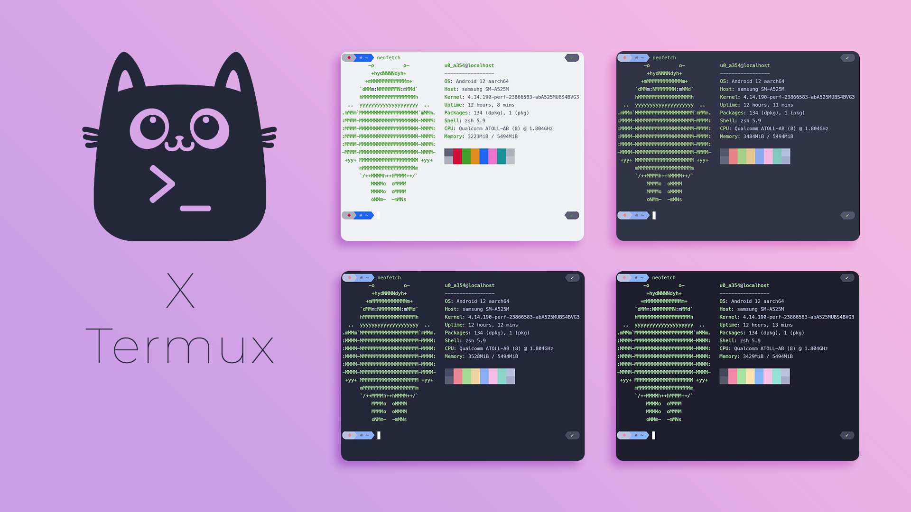

<h3 align="center">
	 
	
	Catppuccin for <a href="https://github.com/termux/termux-app">Termux</a>
	
</h3>

    
    
    

  

## Usage

Catppuccin is now [included in Termux](https://github.com/termux/termux-styling/blob/master/app/src/main/assets/colors/catppuccin-mocha.properties).

1. Install the [Termux:Styling](https://github.com/termux/termux-styling/tree/master?tab=readme-ov-file#installation) plugin.
2. In Termux, long press anywhere in the terminal.
3. Click **More...** > **Style** > **CHOOSE COLOR**.
4. Scroll down the list and select your preferred Catppuccin flavor.

## 💝 Thanks to

- [Pocco81](https://github.com/Pocco81)
- [Adal Zanabria](https://github.com/AdalZanabria)
- [rubyowo](https://github.com/rubyowo)

&nbsp;

Copyright &copy; 2021-present <a href="https://github.com/catppuccin" target="_blank">Catppuccin Org</a>

